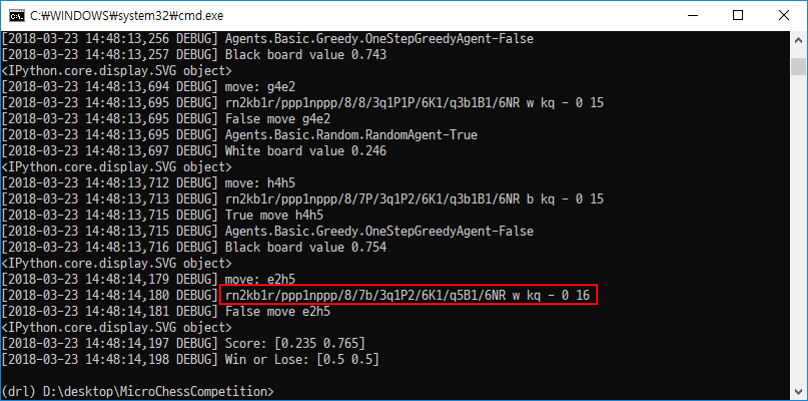
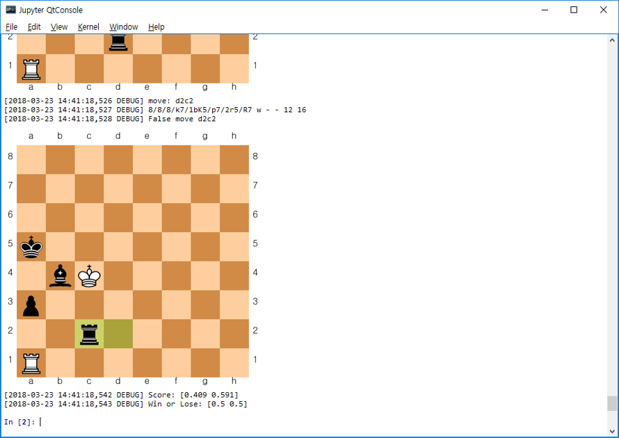
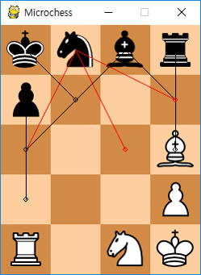

.. raw:: latex

    \newpage

Microchess AI 플랫폼
====================

개요
----

- Microchess 플랫폼 구현
    - 일반 체스 플랫폼인 python-chess [#]_ 을 수정하여 구현
- Python으로 AI를 작성할 수 있는 기반을 제공함
- 주요 AI 예제 네 가지 제공
    - Random AI, 탐색 기반 AI, MCTS AI, Self Learning AI
- 사람과 AI 체스 플레이 가능한 인터페이스 제공
- 개발 및 테스트 환경
   - python 3.5 (anaconda)
   - Windows 10

다른 python 버전이나, 배포판, 다른 OS 에서 심각한 문제가 발생할 가능성은 적지만,
이 문서는 위 환경을 기준으로 작성되었다.

디렉토리 구조
-------------

::

   MicrochessAICompetition
    ├── chess: Microchess 용으로 수정한 python-chess
    ├── scripts: 실행 스크립트 및 기타 파일
    └── agents
            ├── basic: 기본 AI 예제
            ├── search: 탐색 기반 AI, MCTS 예제
            ├── self_learning: 학습 AI 예제
            └── stockfish: 다른 언어로 구현된 AI 사용 예제

설치방법
---------

1. 플랫폼 다운로드 및 압축해제
2. anaconda 다운로드 및 설치 (https://www.anaconda.com/download/)

3. 가상환경 생성 및 활성화::

   (base) C:\Users\user\MicrochessAICompetition> conda create –n mchess python=3.5
   (base) C:\Users\user\MicrochessAICompetition> activate mchess
   (mchess) C:\Users\user\MicrochessAICompetition>

4. 주요 모듈 설치::

   (mchess) C:\Users\user\MicrochessAICompetition> conda install numpy scipy ipython tqdm pyyaml mkl matplotlib
   (mchess) C:\Users\user\MicrochessAICompetition> conda install -c CogSci pygame
   (mchess) C:\Users\user\MicrochessAICompetition> pip install sqlitedict
   (mchess) C:\Users\user\MicrochessAICompetition> pip install visdom  # visdom 설치
   (mchess) C:\Users\user\MicrochessAICompetition> conda install -c peterjc123 pytorch-cpu=0.3.0  # pytorch 설치 (CPU, Windows 용)

- visdom은 AI 디버깅 및 데이터 시각화 용으로 사용함
   - MCTS AI와 Self Learning AI에서 사용
- pytorch는 비공식 Windows + CPU 버전(https://github.com/peterjc123/pytorch-scripts) 사용
   - 최신 버전인 0.4.0 버전은 정식으로 Windows를 지원하지만, 개발에 사용한 0.3.1 버전은 정식으로 Windows를 지원되지 않음
   - 0.3.1 버전과 0.4.0 버전의 대부분은 호환되지만, 0.4.0을 이 플랫폼에서 검증하지 못했음
   - CUDA 지원버전을 사용할 수 있지만, CUDA 사용가능한 부분이 적어서 속도향상이 크지 않고, 학습 성능 검증이 부족함

실행 방법
---------

예제 AI 실행

- Random AI vs. One Step Search AI
    - Random AI 위치: agents/basic/random_agent.py
    - One Step Search AI: agents/search/bruteforce_search_agent.py

.. code::

    (mchess) C:\Users\user\MicrochessAICompetition> python scripts/run_game.py --white=agents.basic.random_agent.RandomAgent --black=agents.basic.bruteforce_search_agent.OneStepSearchAgent

.. _fen_example:

   fen [#]_ 표기법으로 보드 상태 출력

- Jupyter qtconsole 에서 실행

.. code:: ipython

    (mchess) C:\Users\user\MicrochessAICompetition> jupyter qtconsole
    In [1]: %run scripts/run_game.py --white=agents.basic.random_agent.RandomAgent --black=agents.search.bruteforce_search_agent.OneStepSearchAgent

.. _qt_console_example:

    Qt Console 화면

**Random AI vs. Random AI**

AI끼리 게임을 플레이할 때는 scripts/run_game.py 을 사용한다. 두 Random AI끼리 플레이할 때는 다음과 같이 실행한다.::

   python scripts/run_game.py --white=agents.basic.random_agent.RandomAgent --black=agents.basic.random_agent.RandomAgent

White와 black에 AI의 경로를 지정해 주면 게임을 실행하고, 결과를 출력해 준다.

예제 AI는 AI의 경로를 run_game.py의 agents에 미리 저장해 두었기 때문에, 전체 경로를 지정할 필요없이 다음과 같이 짧은 이름으로 실행 가능하다.::

   python scripts/run_game.py --white=random --black=random

.. literalinclude:: ../scripts/run_game.py
   :lines: 406-420
   :caption: 예제 AI의 이름과 경로

Random AI와 One Step Search AI의 게임은 다음과 같이 실행 가능하다.::

   python scripts/run_game.py --white=random --black=one_step_search

One Step AI는 다음 수의 결과를 고려하는 간단한 AI이다. 강력하지는 않지만, Random AI는 쉽게 이길 수 있다.
실행한 결과는 다음과 같이 나타난다.

.. code-block:: none
   :linenos:

   [2018-04-23 15:40:07,079 DEBUG] White: agents.basic.random_agent.RandomAgent-True
   [2018-04-23 15:40:07,079 DEBUG] White: board value 0.500
   <IPython.core.display.SVG object>
   k n b r
   p . . .
   . . . .
   . . . P
   R B N K
   [2018-04-23 15:40:07,093 DEBUG] White: 400.0 sec. remain
   [2018-04-23 15:40:07,093 DEBUG] White: move b1d3
   [2018-04-23 15:40:07,093 DEBUG] 8/8/8/knbr4/p7/3B4/3P4/R1NK4 b Kk - 1 1
   ...  (생략)
   [2018-04-23 15:30:05,171 DEBUG] White: move d2c1
   [2018-04-23 15:30:05,172 DEBUG] 8/8/8/8/3k4/8/8/2K5 b - - 0 37
   [2018-04-23 15:30:05,172 DEBUG] [0.5, 0.5]
   [2018-04-23 15:30:05,172 DEBUG] draw
   <IPython.core.display.SVG object>
   . . . .
   . . . k
   . . . .
   . . . .
   . . K .
   [2018-04-23 15:30:05,178 DEBUG] Score: [0.500 0.500]
   [2018-04-23 15:30:05,178 DEBUG] turns: 72
   [2018-04-23 15:30:05,178 DEBUG] Game end: True
   [2018-04-23 15:30:05,179 DEBUG] checkmate: False
   [2018-04-23 15:30:05,179 DEBUG] Stalemate: False
   [2018-04-23 15:30:05,179 DEBUG] Insufficient material: True
   [2018-04-23 15:30:05,179 DEBUG] 57 moves: False
   [2018-04-23 15:30:05,179 DEBUG] 5-fold: False
   [2018-04-23 15:30:05,179 DEBUG] Draw: [0.5, 0.5]

4~8번째 줄 처럼 매 턴마다, 게임 상태를 텍스트 상태로 출력한다. white는 대문자로 표시하고, black은 소문자로 표시한다.

23번째 줄부터 게임 결과를 출력한 것이다. Score의 첫번째 숫자는 white의 점수를 나타내고, 두 번째 숫자는 black의 점수를 나타낸다.
(특별한 경우가 아니면 플랫폼의 나머지 부분에서도 white를 black보다 먼저 출력함)
게임에 승리하면 1.0, 패배하면 0.0, 그리고 비기면 0.5점을 얻는다.

일반 Chess (Microchess 포함)와 달리 이 플랫폼에서는 승패가 결정되지 않으면,
게임이 종료되었을 때 남아있는 기물의 점수를 계산하여 최종 승패를 판단한다.
따라서, 기존 무승부 조건을 만족한 상태에서 기물의 점수도 동일한 경우만 무승부가 가능하다.

turns는 전체 게임의 턴 수를 보여주고, 그 다음 줄의 game end는 게임이 정상적으로 종료되었는지 여부를 알려준다.
그 다음부터는 게임이 종료된 이유(checkmate, stalemate, 등)를 알려준다.

AI 끼리의 성능을 평가할 때는 benchmark 옵션을 사용한다. benchmark 옵션을 사용하면, 지정된 white와 black 옵션과 상관없이
총 20게임 (지정된 white와 black으로 10게임, white와 black을 뒤집어서 10게임)을 플레이하고 전체 승률을 출력해준다.

**Random AI vs. One Step Search AI**

Random AI와 One Step Search AI의 성능을 비교하려면 다음과 같이 실행한다.::

   python scripts/run_game.py --white=random --black=one_step_search --benchmark

실행 결과는 다음과 같이 나타난다.

.. code-block:: none
   :linenos:

   [2018-04-23 15:52:19,247 INFO]          random          |    one_step_search
   [2018-04-23 15:52:19,247 INFO] W                  0.000 | B                  1.000
   [2018-04-23 15:52:19,247 INFO] W                  0.500 | B                  0.500
   ... (생략)
   [2018-04-23 15:52:19,248 INFO] B                  1.000 | W                  0.000
   [2018-04-23 15:52:19,248 INFO] B                  0.000 | W                  1.000
   [2018-04-23 15:52:19,248 INFO] random (White): 0.300 vs. one_step_search (Black): 0.700
   [2018-04-23 15:52:19,249 INFO] random (Black): 0.350 vs. one_step_search (White): 0.650
   [2018-04-23 15:52:19,250 INFO] random: 0.325 vs. one_step_search: 0.675

7번째 줄 까지는 두 AI가 얻은 점수를 보여주고, 마지막 세 줄은 그 평균을 보여준다.
두 AI가 각각 White/Black 그리고 Black/White인 경우의 평균을 따로 보여주고, 마지막으로 둘을 통합한 평균을 보여준다.
이 결과에서는 One Step Search AI가 평균 0.675점을 얻어 더 좋은 성능을 보여주고 있다.

인간 플레이어 vs. AI 인터페이스
-------------------------------

AI 성능 테스트 용으로 게임 플레이 인터페이스 제공한다. AI의 경로를 입력하는 부분에 human이라고 쓰면, AI와 동일한 방식으로 실행할 수 있다.
인간 플레이어로 게임을 실행하면, :ref:`human_play_interface` 가 나타나고, 플레이어의 순서에 마우스로 조작이 가능해진다.

.. code::

    (mchess) C:\Users\user\MicrochessAICompetition> python scripts/run_game.py --white=agents.basic.random_agent.RandomAgent --black=agents.basic.human.Player

.. _human_play_interface:

    인간 플레이어 인터페이스

.. [#] https://github.com/niklasf/python-chess
.. [#] https://en.wikipedia.org/wiki/Forsyth-Edwards_Notation

