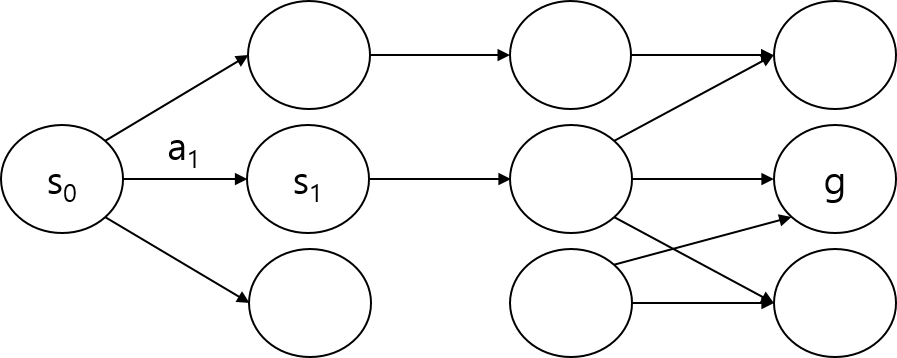
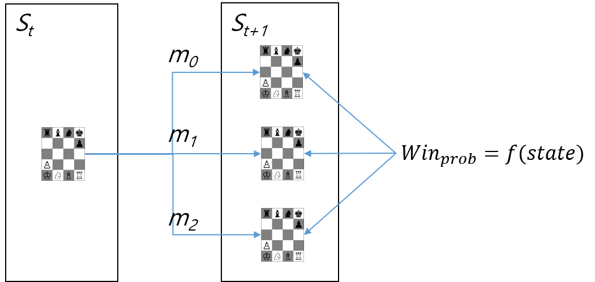
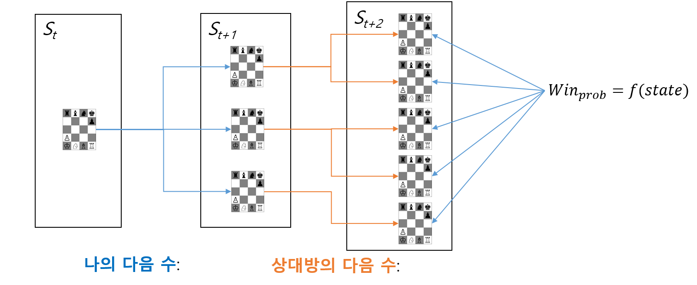
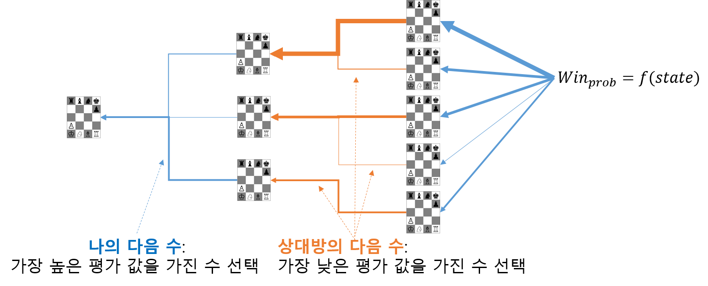
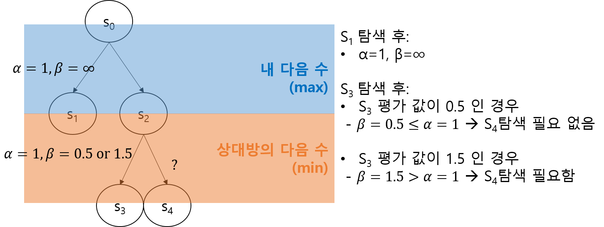
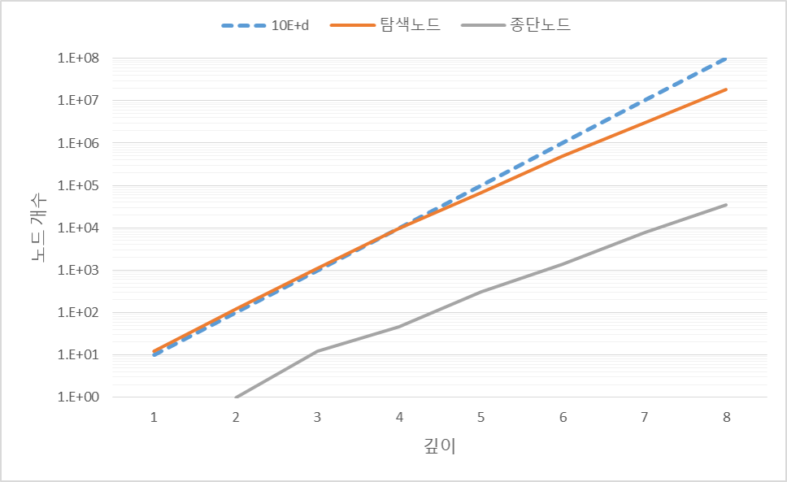
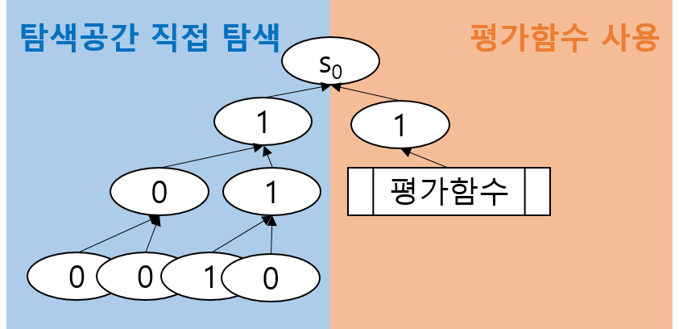
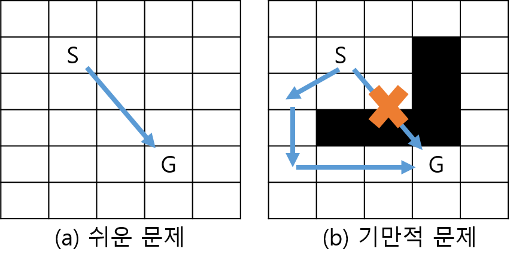

.. raw:: latex

    \newpage

기본 AI 예제
============

Random AI
---------

.. _random_ai_code:
.. literalinclude:: ../agents/basic/random_agent.py
   :linenos:
   :lines: 7-25
   :caption: Random AI

가장 간단한 AI 구현
~~~~~~~~~~~~~~~~~~~

:ref:`random_ai_code` 는 이 플랫폼을 이용해 구현된 가장 간단한 AI 중 하나이다.
이 AI의 목적은 플랫폼 사용자들에게 AI를 구현하는 가장 기초적인 방법에 대해 설명하고,
AI 성능의 최저 기준선을 제시하는 것이다.
새로 구현한 AI가 Random AI에 대비하여 명확하게 좋은 성능을 보이지 않는다면,
새로 구현한 AI 제대로 작동하고 있지 않을 가능성이 매우 높다.

AI를 구현할 때는 Random AI처럼 BaseAgent를 상속받아 reset, act, close 메소드를 구현하면 된다.
반드시 필수는 아니지만, 모든 예제 AI는 "agents/{package}/{agent_name}.py" 에 저장하고 있다. package와 agent_name은
AI의 특징을 나타낼 수 있도록 임의로 정하여 사용한다.
게임 시작할 때 AI 클래스의 위치를 "agents.{package}.{agent_name}.{agent_class_name}" 형식으로 전달하면,
플랫폼이 AI 클래스를 import 하여 실행한다.

reset() 메소드는 새로운 게임이 시작하기 전에 한번 호출된다. 보통 이 메소드에서는 AI 초기화 작업을 진행한다.
예를 들면 학습한 모델이나 데이터를 메모리로 읽어들이는 작업을 이때 할 수 있다.

close() 메소드는 반대로 게임이 종료되었을 때, 한번 호출된다. 여기서는 아직 열려있는 파일을 닫거나,
메모리에 아직 남아있는 데이터를 저장하는 등의 작업을 할 수 있다.

reset()과 close() 메소드는 필요하지 않다면, 반드시 구현할 필요는 없다.
구현하지 않으면 BaseAgent에 있는 아무것도 하지 않는 reest()과 close()가 사용된다.

하지만, act(state) 메소드는 반드시 구현해야 한다. 이 메소드는 해당 AI 턴마다 실행된다.
인자로 전달되는 state는 현재 게임 상태정보를 가지고 있다. AI는 이 정보를 이용해서 다음에 둘 수를 반환해야한다.
AI를 구현한다는 것은 기본적으로 이 부분에 특정 게임상태(state)와 최선의 수(move)를 매핑해주는 함수를 정의하는 일이다.

state 인스턴스는 :class:`~scripts.run_game.State` 객체이다. State객체는 python-chess의 :class:`~chess.__init__.Board` 객체를 상속받아
시뮬레이션 기능을 지원하는 forward(move) 메소드를 추가한 것이기 때문에, 기본적으로 chess.Board객체에서 지원하는 기능을
모두 가지고 있다. 향후 부정행위에 이용할 만한 기능을 발견되면 일부 기능이 제한될 수 있다.

Board 객체에서 지원하는 기능 중에 하나는 주어진 게임상태에서 둘 수 있는 수를 알려주는 것이다. 15번째 줄의
state.legal_moves 는 현재 둘 수 있는 수들을 반환하는 python generator이다. Random AI는 이것을 list (moves)에 담은 뒤,
그 중에서 무작위로 하나를 선택(random.choice)하여 반환한다.

act 메소드의 입력과 출력 요약
~~~~~~~~~~~~~~~~~~~~~~~~~~~~~~

act(state) 메소드의 입력과 출력을 핵심을 정리하면 다음과 같다.

- 입력: state
    - python-chess의 Board 객체 + 다음 상태 시뮬레이션(forward)
    - 현재 보드 상태에 대한 정보

- 출력: move
    - python-chess의 Move 객체
    - 기물의 현재 위치, 다음 위치 저장
    - [0, 20] 정수 x [0, 20] 정수 = 400 가지 조합 가능함
    - 특정 상태에서 선택가능한 수는 평균 10개 정도

Search 기반 AI
----------------

AI가 하는 가장 기본적인 작업은 특정 상태(:math:`s` ; state)가 주어졌을 때, 최선의 행동(:math:`a`; action)을 결정하는 일이다.
즉 우리는 AI를 상태와 행동을 매핑하는 일종의 함수라고 볼 수 있다(:math:`f(s) \rightarrow a`).
일반적으로는 행동(:math:`a`; action)으로 표현하지만, 체스같은 보드게임에서는 수(:math:`m`; move)라고 표현하므로, 이 문서에는 필요에따라
행동(:math:`a`)과 수(:math:`m`)를 혼용해서 한다.

현재 적합한 행동을 결정하는 가장 간단한 방법은 실제 그 행동을 했을 때, 어떤 결과가 나타날지 시뮬레이션을 해보고,
가장 좋은 결과가 나타나는 행동으로 다음 행동을 결정하는 것이다.
시뮬레이션은 현재 상태(:math:`s_t`)와 행동(:math:`a`)이 주어졌을 때, 다음 상태(:math:`s_{t+1}`)를 반환해주는 함수
(:math:`f(s_t, a) \rightarrow s_{t+1}`)로 볼 수 있는데, 이 플랫폼에서는 State.forward(move) 함수가 그 역할을 한다.
foward 함수는 게임로직과 동일하게 작동하고, 상대방의 미래 행동을 제외하면 게임에는 불확실성이 없기 때문에
상대방의 미래 행동을 정확하게 예측할 수 있다면 정확한 미래 상태를 예측할 수 있다.

.. _state_space_example:

   상태공간

Simulation 함수가 정의되고 나면, 그래프 구조로 만들어진 :ref:`state_space_example` 을 만들 수 있다. 
각각의 노드는 특정 상태(예. 특정한 체스기물의 배치상태)를 나타내고,
노드와 노드를 연결하는 링크는 행동을 의미한다. AI의 궁극적인 목적은 상태공간의 시작 상태(:math:`s_0`)에서 시작하여,
목표상태(:math:`g`, 게임에 승리한 상태)까지 도달하기 위해 현재 어떤 행동을 해야하는지 알아내는 것이다.
이것은 그래프 구조에서 경로를 탐색하는 문제로 취급할 수 있기 때문에 순회(traverse), 탐색(search) 알고리즘을 사용해 문제를 해결한다.
따라서 이런 방식의 AI를 탐색(Search)기반 AI라고 한다.

실제 상태공간은 순환(cycle)이 존재하는 그래프지만 문제를 단순화하기 위해 일반적으로는
순환을 없에고(실제 동일한 상태를 새로운 상태로 취급) 상태공간을 트리 구조로 모델링한다.

One Step Search AI
~~~~~~~~~~~~~~~~~~

.. _one_step_search_ai:

   One Step Search AI

:ref:`one_step_search_ai` 는 바로 다음 수의 결과만을 예측하여 현재 행동을 결정하는 가장 단순한 Search 기반 AI이다.
현재 상태 :math:`S_t` 에서 가능한 수를 모두 시뮬레이션 하여, 다음 상태 :math:`S_{t+1}` 들을 알아낸 뒤,
목표상태와 가장 가까운 상태를 찾아, 그와 연관된 수를 다음 수로 결정한다.

여기서 목표상태와 얼마나 가까운지 판단하기 위해 평가함수를 사용한다.
평가함수는 현재 상태(:math:`s`)를 입력받아, 이것이 목표상태(:math:`g`)에 얼마나 가까운지 정량적으로
측정하는 함수이다(:math:`eval(s) \rightarrow v`).

 .. math::
   :label: eval_func

   v = \frac{{score}_{my}}{{score}_{my} + {score}_{opponent}}

One Step Search AI가 사용하는 평가함수 :eq:`eval_func` 는 얼마나 승리에 가까운지 평가하여 [0, 1] 실수로 반환한다.
자신과 상대방의 점수(:math:`{score}_{my}, {score}_{opponent}`)는 :ref:`score_table` 의 기물점수를 사용한다.
패배에 가까울 수록 0에 가깜고, 승리에 가까울 수록 1에 가까운 값을 반환한다.

가장 간단한 탐색 방법을 사용하는 One Step Search AI는 Random AI 보다는 좋은 성적을 보이지만,
한 수 이상을 고려하지 않기 때문에, 여러가지 문제를 가지고 있다.
상대방의 대응을 예상하지 못하기 때문에 쉽게 반격당할 수 있고,
다음 상태에서, 다른 상태에 비해 더 좋은 상태가 없는 경우 의사결정이 어렵다.
이 문제의 원인은 One Step Search AI가 매우 단기적인 이익 만을 추구하기 때문에,
장기적인 계획(연속된 행동)이 필요한 목표를 추구할 수 없기 때문이다.

따라서 이 문제의 근본적인 해결 방법은 더 먼 미래까지 탐색하는 것이 된다.

Two Step Search AI
~~~~~~~~~~~~~~~~~~

.. _two_step_search_ai:

    Two Step Search AI

:ref:`two_step_search_ai` 는 이 방향에서 One Step Search AI를 개선한 것이다. Two Step Search AI는 이름 그대로
두 단계 미래 상태 (:math:`S_{t+2}`)까지 탐색하고 가장 좋은 상태로 연결되는 수를 찾아내는 AI 이다.

Two Step Search 에서 두 번째 수는 내가 아닌 상대방의 수 이기 때문에, 미래 상태를 예측 하려면
다음에 상대방이 어떤 수를 둘 것인지를 알아야 한다. 실제로 상대방이 다음에 어떤 수를 둘 지는 알 수 없지만
상대방도 나와 마찬가지로 현재 상태를 목표상태에 가깝게 바꿔나가고자 한다고 가정하면, 상대방의 수를 예측할 수 있다.

Chess 같은 zero-sum 게임 [#]_ 에서는 상태의 평가 점수가 낮을 수록 상대방의 입장에서는 유리한 것이기 때문에,
내가 더 좋은 상태로 연결되는 수를 선택해야하는 것과는 반대로 상대방은 (나에게) 더 나쁜 상태로 연결되는 수를 선택할 것이다.

.. _two_step_search_ai_eval:

    Two Step Search AI의 평가 과정

:ref:`two_step_search_ai_eval` 은 그림 처럼 마지막 상태들을 평가한 뒤에, 꺼꾸로 가장 먼 미래서부터 현재 상태까지 어떤 행동들을 선택해야
가장 높은 평가를 받은 마지막 상태에 도달할 수 있는지 알아낸다. 차례대로  가장 낮은 평가값를 받은 상태로 연결되는 수(상대순서),
가장 높은 평가를 받은 상태로 연결되는 수(내 순서)를 선택하여 현재 상태에서 두어야 할 수를 결정한다.

Two Step Search AI 구현
~~~~~~~~~~~~~~~~~~~~~~~

.. _two_step_search_ai_code:
.. literalinclude:: ../agents/search/two_step_search_agent.py
   :linenos:
   :lines: 32-63
   :caption: Two Step Search AI (Greedy AI)

:ref:`two_step_search_ai_code` 은 Two Step AI의 핵심인 act 와 opponent_act 메소드이다.
act 메소드는 state(:math:`s_t`)를 입력받아, 다음 상태(:math:`s_{t+1}`)를 평가할 때, 상대방이 대응하고
난 뒤의 상태(:math:`s_{t+2}`)를 먼저 평가한 뒤에 그 결과를 이용한다.

매우 많은 약점을 노출하는 One Step Search AI와 달리, Two Step Search AI는 쉽게 반격당하는 무모한 공격을 하지
않기 때문에 상당히 그럴듯하게 작동한다. 하지만, 실수하지 않고 주의깊게 공략하면 쉽게 이길 수 있다.

기본적으로 Two Step Search AI는 One Step Search AI와 동일한 한계를 가진다. Two Step Search AI도 두 수 이상의 미래는
고려하지 않기 때문에, 두 수 이내에서 현재보다 좋은 상황이 없을 경우 다음 수를 결정하기 어렵고,
상대방이 두 수 이상을 고려한 전술을 사용할 경우 효과적으로 대처가 불가능하다.

이것을 해결하는 직접적인 방법은 보다 깊게(먼 미래) 상태공간을 탐색하는 것이다.
두 수만이 아니라, 더 많은 미래의 경우의 수를 계산하면 쉽게 성능을 높일 수 있다.
Microchess는 모든 정보가 공개된, 불확실성이 없는 게임이기 때문에, 상대방의 행동만 예상할 수 있다면
게임 시작부터 끝날 때 까지 모든 상태를 탐색할 수는 있다.

Two Step Search AI과 같은 방식의 AI를 보다 일반적으로 구현한 것이 Negamax Search이다.
Negamax Search는 Two Step Search AI와 달리 임의의 미래까지 탐색이 가능하다.

Negamax Search AI
~~~~~~~~~~~~~~~~~

.. _negamax_search_code:
.. literalinclude:: ../agents/search/negamax_search_agent.py
   :linenos:
   :lines: 44-76
   :caption: Negamax Search 함수

Negamax Search [#]_ 는 Minimax Search의 일종으로, 구현을 단순하게 하기 위해, 평가값 구간을 [0, 1] 사이 실수로 하는 대신,
[-1, 1] 사이 실수를 사용한다. 한 단계 미래상태를 탐색할 때마다, 보상값에 -1을 곱하여
상대방의 입장에서도 최대값(-를 곱했으므로 나에게는 최소값)을 찾도록 구현하였다.
재귀적으로 :ref:`negamax_search_code` 를 호출하면서, 깊이 우선탐색(depth-first search)로 정해진 최대 깊이(미래 상태)까지 탐색하고,
그 중에 가장 좋은상태로 연결되는 현재 수와 평가값을 반환한다.

여기서 가장 중요한 파라미터는 최대 탐색깊이(depth 인자)이다.
Microchess를 포함한 대부분의 문제에서 하나의 행동으로 목표를 달성하는 경우는 드물고,
보통 연속된 행동의 결과로 목표 상태에 도달할 수 있다.
따라서 시작상태부터 목표상태까지 경로를 찾아내기 위해서는 가능한 먼 미래 상태까지 탐색할 필요가 있다.
만약 탐색깊이가 부족하면, 모든 상태를 탐색했음에도 불구하고, 목표상태를 발견하지 못할 수 있다.
그러나, 탐색 깊이를 증가시키면 탐색공간이 지수적으로 증가하기 때문에 매우 많은
계산비용이 필요할 수 있다. 따라서, 목표까지의 거리와 탐색 비용은 상충관계(trade-off)에 해당하고, 
이것을 고려해서 최대 탐색 깊이를 신중히 결정해야한다. 탐색깊이가 부족해서 목표상태를 발견하지 못하는 현상을
수평선 효과(horizon-effect [#]_ )라고 하며, AI 분야에서 대표적인 문제 중의 하나이다.

이 플랫폼에서는 기물점수를 계산해서 승패에 중요한 요소로 삼기 때문에, 수평선 효과가 상대적으로 덜 발생할 수 있다.
기존 체스(Microchess 포함)에서는 게임 종료상태까지 탐색하지 못하면(약 80수), 현재 수의 좋고 나쁨을 판단할 수 없기 때문에
충분히 먼 미래를 탐색하지 않으면 수평선효과가 강하게 나타날 수 밖에 없다. 하지만 이 플랫폼의 기본 규칙에서는
내 기물을 지키고 상대방의 기물을 제거하기만 하면(5수 이하) 더 좋은 상태로 판단할 수 있기 때문에 얕은(가까운 미래) 탐색만으로도
상태의 좋고 나쁨을 쉽게 판단할 수 있다.

Negamax Search AI + :math:`\alpha-\beta` pruning
~~~~~~~~~~~~~~~~~~~~~~~~~~~~~~~~~~~~~~~~~~~~~~~~~

:math:`\alpha-\beta` pruning [#]_ 은 Negamax 알고리즘의 탐색공간을 줄여주는 대표적인 기법이다.
기본 아이디어는 탐색하는 도중에 상대방 순서에서 찾아낸 최소 평가값(:math:`\beta`)이 그 이전의 내 순서에서
찾아낸 최대 평가값(:math:`\alpha`) 보다 작거나 같으면(:math:`\beta \le \alpha`), 나머지 수를 탐색하지 않고,
현재 평가값을 최종 평가값으로 반환하는 것이다.
이 경우 나머지 수에서 어떤 작은 평가값이 나와도, 그 위 단계에서 나는 그것을 선택하지 않고 :math:`\alpha` 을 선택할
것이기 때문에 더 이상 탐색할 필요가 없다.

.. _alpha_beta_pruning_example:

   :math:`\alpha-\beta` pruning 예

간단한 :math:`\alpha-\beta` :ref:`alpha_beta_pruning_example` 를 보면 :math:`S_1` 에서 평가값 1을 얻었을 때,
다음 평가 대상인 :math:`S_3` 의 평가값이 1보다 낮거나 높거나 두 가지 가능성이 있다. 
만약 이 값 이 1보다 작은 0.5가 나온다면 :math:`S_4` 는 탐색이 필요없다. :math:`S_4` 에서 0.5보다 큰 값이 나온다면
상대방이 이것을 선택하지 않을 것이고, 0.5보다 작은 값이 나온다면 상대방은 선택하겠지만 내가 그것을 선택하지 않을 것이기 때문이다.

:math:`\alpha-\beta` pruning 을 사용한 기본적인 Negamax Search는 :class:`~agents.search.abp_negamax_search_agent.ABPNegamaxSearchAgent` 에 구현되어 있다.
기존 Negamax Search AI는 탐색 깊이 4이상부터 급격히 탐색시간이 증가하여 경진대회에서 가정한 10초를 거의 다 사용한다.
반면 ABP Negamax Search AI는 탐색깊이 6까지는 어렵지 않게 탐색할 수 있다.
계산비용을 절약한 만큼 더 많은 공간을 탐색할 수 있기 때문에, 결과적으로 성능을 향상시킬 수 있다.
이 알고리즘은 일반적인 체스 AI를 구현하는 가장 기본적인 접근방법이다 [#]_.
많은 유명한 AI 들도 기본적으로 이런 접근방법을 사용한다.

Microchess 상태공간 규모
~~~~~~~~~~~~~~~~~~~~~~~~~

.. _state_state_tree:
.. figure:: figs/tree.png
   :figwidth: 500

   상태공간 트리

Microchess 처럼 간단한 문제에서도 모든 탐색공간을 탐색하는 것은 현실적으로 매우 어렵다고 볼 수 있다.
한 상태에서 선택가능한 수가 평균적으로 10개이고, 게임 길이가 평균 20턴이라고 가정하면, :math:`b` (branch) 가 10이고,
:math:`d` (depth)가 20인 :ref:`state_state_tree` 를 순회해야 하고 가장 좋은 상태를 찾아야 하는데, 총 순회해야할 노드의 개수는
약 :math:`b^d = 10^{20} = 100,000,000,000,000,000,000` 개 [#]_ 정도 된다. 매 초마다, 백만개씩 순회가능하다고 하더라도,
한 수를 두는데 100,000,000,000,000초가 소모된다.
비록 :math:`\alpha-\beta` pruning 같은 기법을 사용하여 불필요한 탐색공간을 줄이더라도, 문제는 크게 완화되지 않는다.
만약 전체 탐색공간의 99%를 제외할 수 있다고 하더라도, 전체 탐색공간에서 0이 두 개 줄어들 뿐이다.

.. _search_space_scale:

   탐색공간의 규모

게임 시작상태부터 실제로 너비우선 탐색으로(breadth-first search)로 가능한 모든 상태를 순회하면
전체 :ref:`search_space_scale` 를 예상해 볼 수 있다.
깊이 8까지 순회한 결과 상태공간의 개수는 예측한 결과와 유사하게 지수적으로 증가하는 것을 볼 수 있다.
깊이가 깊어질 수록 점차 예상보다는 줄어들기는 하지만, 깊이 8에서 증가폭은 여전히 매우 크다.
또한 순회한 상태 중에서 게임이 종료된 상태(종단노드)에 도달하는 수는 전체 공간의 0.01~0.001에 불과하다는 점도 알 수 있다.
때문에 아무런 정보도 없이 탐색 기법만으로 게임이 종료될 상태를 찾아낼 확률은 매우 낮다.

탐색공간이 크기 때문에 게임 도중 탐색하는 대신에, 사전에 미리 탐색하여 데이터를 테이블 형태로 정리해놓고,
탐색을 대체할 수 도 있는데, Microchess 모든 경우의 수를 모두 조사하여 디스크에 저장하려 한다면,
한 상태에 1 Byte씩 소모된다고 해도(실제로는 최소 24bit 필요) 100,000,000TB의 용량이 필요하다.

따라서, 특별한 기술이나 지식없이 게임 도중에 실시간으로 탐색하거나, 
사전에 모두 탐색하여 테이블 형태로 정리해 놓거나, 모든 경우의 수를 탐색하는 것은
상당한 시간과 메모리/디스크 용량을 필요로 한다.

일반 체스에서는 기물이 7~5개 남은 상태에서 모든 경우의 수를 계산해 놓은 Endgame tablebase [#]_ 이 있는데,
이 테이블을 참조하면 게임의 종반부에서 더 이상게임을 진행할 필요 없이 언제 승패가 결정될 지를 알 수 있다.
일반 체스에서 7개 기물을 대상으로한 Syzygy endgame tablebase의 용량은 약 140TB에 달한다고 알려져 있다.
그러나 Microchess는 기물의 개수가 더 많은 데다가, 승리규칙도 조금 다르기 때문에 이 테이블을 직접 사용할 수 도 없다.

평가함수
~~~~~~~~~~

One Step Search 부터 ABP Negamax Search 까지 목표상태로 가는 방향을 알아내기 위해 더 깊이 탐색하는 방법을 사용했다.
더 깊이 탐색할 수록 수평선 효과를 완화할 수 있고, 결과적으로 더 높은 성능을 기대할 수 있기 때문이다.
그러나, 깊이 탐색할 수록 지수적으로 늘어나는 상태공간을 탐색해야하고 일정시점을 넘어가면 더 이상 감당할 수 없는 수준이 된다.

때문에 많은 AI들은 여러가지 다른 접근방법을 동시에 사용한다. 그 중 하나가 정교한 :ref:`eval_func_fig` 를 사용하는 것이다.
지금까지 예제 AI들은 단순히 기물 점수를 이용해서 현재 상태가 얼마나 좋은지 나쁜지를 판단한다.
그러나, 좋은 성능을 보이는 유명한 AI들은 그보다 훨씬 복잡한 평가함수를 사용한다.
기물의 절대적인 위치, 다른 기물과의 상대적인 위치등 다양한 정보를 이용하면, 간단한 평가함수로 잡아낼 수 없는
좋고 나쁨에 대한 신호를 잡아낼 수 있다. 비록 탐색깊이를 계산가능한 수준까지 줄이더라도 평가함수를 이용하면 수평선 효과를 완화할 수 있다.

.. _eval_func_fig:

   평가함수

:ref:`eval_func_fig` 예 에서 왼쪽은 단순한 탐색기법으로 상태공간을 탐색했는데, 총 7개 노드를 탐색했다.
그러나, 평가함수를 사용한 오른쪽은 단 한 개의 노드만을 탐색하고 평가함수로 그것이 얼마나 좋은지 예측하였다.
만약 평가함수가 충분히 정확하다면, 1개 노드 탐색 + 평가함수 실행으로 7개 노드 탐색을 대체하여 계산비용을 대폭 줄일 수 있다.

.. _path_finding:

   경로탐색 문제

대부분 평가함수는 문제(게임)에 대한 전문지식을 가진 전문가에 의해 설계되며, 매우 많은 노력이 필요하다.
잘못된 평가함수는 탐색공간을 왜곡하여 탐색알고리즘이 최종 목표상태를 찾는 것을 방해할 위험성이 있다.
출발지점 S 부터 목표지점 G까지 :ref:`path_finding` (a) 에서, 각 상태에서 선택할 수 있는 행동이 4가지(상, 하, 좌, 우 이동)라고하면,
S 부터 G까지 최소거리는 5이기 때문에, 첫 번째 이동방향을 결정하기 위해 기본적인 트리 탐색으로는 최소한 깊이 5를 탐색할 필요가 있다.
따라서, 최소 :math:`4^5 = 1,024` 개 노드를 탐색하지 않으면 수평선 효과 때문에, 시작 지점에서 어느 위치로 움직여야 하는지 판단할 수 없다.

경로탐색 문제에서 가장 쉽게 사용할 수 있는 평가함수는 현재 위치와 목표지점사이의 거리가 얼마나 가까운지를 이용하는 것이다.
현재 위치와 목표지점이 가까울 수록 큰 평가를 받는 함수(예. 1/거리; :math:`1 / (Gx - Sx) + (Gy - Sy)`)를 설계하고 탐색에 사용하면,
트리 탐색으로 목표지점에 도달하지 못하더라도, 어느 방향으로 이동하는것이 좀 더 가까운지를 판단할 수 있기 때문에,
수평선 효과를 완화할 수 있다.

그러나, :ref:`path_finding` (b) 같은 환경에서는 똑같은 평가함수가 경로탐색에 오히려 방해가 된다. 
목표지점까지 절대적인 거리가 가까운 최단경로에는 큰 장애물이 있기 때문에, AI는 절대 목표지점에 도착하지 못한다.
이 경우에는 오히려 일시적으로 목표지점으로부터 멀어지는 장애물을 우회하는 경로가 더 가까운 경로지만,
평가함수는 그것을 반영하지 않았다. 이런 문제를 기만적 문제(deceptive problem) [#]_ 이라고 한다.

:ref:`path_finding` (b)예 에서처럼 문제의 규모가 매우 작고 장애물이 명확하게 보인다면 
평가함수를 개선할 수 있지만, 대부분의 문제는 이렇게 쉽게 해결되지 않기 때문에 
좋은 평가함수를 설계하는 것은 매우 어려운 작업이다.

이론적으로는, 매우 정교한 평가 함수를 정의할 수 있어서 모든 상태에서 각 상태가 얼마나 상대적으로 좋은지 알아낼 수 있다면,
언제나 현재 상태보다 더 좋은 상태로 연결되는 행동을 선택함으로써, 목표상태에 도달할 수 있다.
이 경우 One Step Search 만으로도 목표상태를 찾아갈 수 있다. 그러나 실질적으로 우리는 각 상태가 목표지점에 얼마나 정확한지
정확하게 알 수 없기 때문에, 우리가 신뢰할만한 평가값을 알 수 있는 상태까지 깊이 탐색할 수 있는 효율적인 탐색알고리즘이 도움이 된다.

Stockfish
~~~~~~~~~

실제로 강력한 체스 AI들은 빠르고 효율적인 탐색알고리즘(Minimax Search + :math:`\alpha-\beta` pruning)과
정교한 평가함수를 결합한 형태로 구현되었다고 알려져 있다. 계산 자원이 한정된 상황에서 탐색능력이 비슷하다면
그들 사이에 성능을 결정짓는 것은 얼마나 정교하고 정확한 평가 함수를 사용하느냐에 달려있다.

Stockfish [#]_ 는 그 중에서도 가장 성능이 좋은 체스 AI로 알려져 있다.
개인용 데스크톱이나 스마트폰에서 작동할 수 있을 정도로 가볍지만, 체스 AI 중에서 가장 높은 성능을 보여준다.
이 플랫폼에서도 :class:`~agents.stockfish.agent.Stockfish` 래퍼로 Stockfish 8을 사용할 수 있다.

경진대회 플랫폼에서 직접 지원하지는 않지만,
원래 체스 AI 분야에서는 여러가지 방식으로 구현된 체스 AI(일반적으로는 체스 엔진 이라고 표현)들이
서로 게임을 플레이할 수 있도록 UCI(Universal Chess Interface) [#]_ 라는 공통 인터페이스를 정의했다.
이 플랫폼에서는 python-chess의 UCI 지원기능 [#]_ 을 이용해 다른 언어(C++)로 구현된 Stockfish를 간접적으로 지원한다.
UCI는 PIPE를 이용해 서로 인터페이스 하므로, 이것을 구현하기만 하면 python 이외에 다른 언어로도 AI를 구현할 수 있다.

Stockfish는 매우 효율적인 탐색알고리즘과 정교한 평가함수를 가지고 있기 때문에 Microchess에서도 뛰어난 성능을 보여준다.
다만, 경진대회의 평가기준과 달리 일반 체스의 규칙을 따르기 때문에 
일반 체스에서 Stockfish의 실력보다 이 플랫폼의 Stockfish는 낮은 성능을 보이고 있을 가능성이 높다.
예를들어, 경진대회 규칙으로는 패배지만, 일반 체스의 규칙으로는 무승부라면 Stockfish는 무승부 상태라고 잘못 판단하기 때문에, 실제 게임에서는 패배할 것이다.
이런 제약에도 불구하고, Stockfish는 상당히 강력해서, 지금까지 소개한 예제 AI들은 Stockfish를 이기기 매우 어렵다.

하지만, 경진대회에서 규칙에서 기존 Stockfish의 성능을 더 높이는 작업은 매우 어려울 가능성이 높다.
빠르고 효율적인 탐색 알고리즘 구현은 체스와 관련된 전문지식과 거의 상관없이 때문에 쉽게 재활용 가능하지만, 
일반 체스에 최적화된 평가함수를 Microchess에 맞게 수정하는 것은, 매우 많은 시행작오가 필요할 것이다.

.. [#] 한쪽의 승리가 다른쪽에서는 패배가 되는 게임
.. [#] https://en.wikipedia.org/wiki/Negamax
.. [#] https://en.wikipedia.org/wiki/Horizon_effect
.. [#] https://en.wikipedia.org/wiki/Alpha–beta_pruning
.. [#] https://medium.freecodecamp.org/simple-chess-ai-step-by-step-1d55a9266977
.. [#] https://en.wikipedia.org/wiki/Endgame_tablebase
.. [#] 일반 Chess 상태의 수 :math:`b^d = 35^{80}`
.. [#] Chen, Yang, et al. "Solving deceptive problems using a genetic algorithm with reserve selection." Evolutionary Computation, 2008. CEC 2008.(IEEE World Congress on Computational Intelligence). IEEE Congress on. IEEE, 2008.
.. [#] https://stockfishchess.org/
.. [#] https://it.wikipedia.org/wiki/Universal_Chess_Interface
.. [#] http://python-chess.readthedocs.io/en/latest/uci.html

