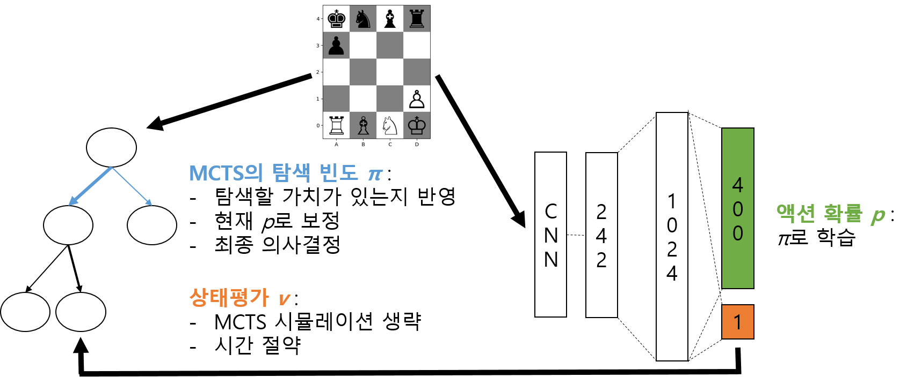

.. raw:: latex

    \newpage

Self Learning AI
================

MCTS를 포함해 트리 탐색 알고리즘의 성능을 개선하는 방법은 크게 두 가지가 있다.
첫째, 탐색할 가치가 있는 상태를 선별적으로 탐색한다. 둘째, 정교한 평가함수를 사용한다.
첫 번째 방법은 흔히 가지치기(pruning)라고 불리는 방법으로, 여러 행동들 중에서 실제로 탐색해보지 않더라도,
결과가 나쁠 것으로 예측 되는 것을 무시하는 기법이다. :math:`\alpha-\beta` pruning 도 이런 기법의 일종이다.
이런 기법들은 :math:`O(b^d)` 에서 *b* 를 줄이는 효과가 있다.
두 번째 방법은 높은 성능을 보이는 많은 AI에서 사용하는 방법이다. 전문가에 의해 혹은 데이터에 기반해 설계된 정교한
평가함수를 이용해 실제 시뮬레이션을 해보지 않고 미래를 예측하는 것이다. 실제 결과와 차이가 있을 가능성이 있지만,
잘 설계한다면 :math:`O(b^d)` 에서 *d* 를 크게 줄일 수 있다.
:math:`\alpha-\beta` pruning 은 특정 게임에 대한 전문지식에 의존하지 않지만, 이런 기법들의 대부분은 특정 게임에 강하게 종속되어 있다.
때문에 Stockfish가 아무리 강력한 체스 AI라고 해도, 장기나 바둑같은 다른 보드게임을 전해 플레이 할 수 없는 것이다.
반면 MCTS는 전문지식에 거의 의존하지 않기 때문에 최소한의 변경만으로도 다른 게임에 쉽게 적용가능하다.
하지만, 기본 계산비용이 크기 때문에 계산비용을 줄이기 위한 방법이 필요하고, 결국 가지치기나 평가함수를 도입할 필요가 있다.
단, 가지치기나 평가함수가 전문지식에 의존하지 않아야 MCTS의 장점을 유지할 수 있다.

Alpha Go Zero [#]_ 는 이 문제를 해결한 가장 유명한 예이다. 기본 의사결정은 Monte-Carlo Tree Search (MCTS)를 사용하면서,
인공신경망을 이용해 가지치기와 평가를 수행한다.
기존 Alpha Go [#]_ 도 이것과 동일한 접근방법이지만, 인공신경망을 학습할 때, 사람들이 플래이한 기보를 이용해 기본학습을 진행했다.
아무것도 모르는 처음(scratch)부터 학습하는 것은 어렵기 때문에 기보 데이터를 이용해 기본적인 플레이방법을 학습하고,
그 이후 강화학습으로 성능을 향상시키는 방법을 사용했다.
반면 Alpha Go Zero 는 처음부터 기보 데이터를 전혀 사용하지 않고, AI 가 스스로 게임을 플레이(Self Play) 하면서
게임 데이터를 수집하고 학습 하였다.
따라서, Alpha Go Zero는 전혀 탐색알고리즘, 가지치기, 그리고 평가함수까지 알고리즘의 거의 모든 부분이 전문지식(도메인 지식)에 독립적이다.
그 덕분에 Alpha Go Zero가 발표된지 불과 몇 달 뒤에 바둑 뿐 아니라 다른 보드 게임을 모두 플레이 할 수 있는 Alpha Zero [#]_ 가 공개되었다.
Alpha Zero는 학습을 시작한지 불과 4시간만에 기존에 가장 강력한 AI였던 Stockfish를 뛰어넘는 성능에 도달할 수 있었다.

Self Learning AI 예제는 Alpha Go Zero와 유사한 방식으로 구현되었다. 실제 Alpha Zero는 매우 큰 계산비용을 요구하기 때문에,
최종 학습성능은 부족하더라도, 보다 빠르게 학습 결과를 확인할 수 있도록, 보다 간단하게 구현했다.
평가방식으로는 MCTS AI와 마찬가지로 Stockfish를 대상으로 승률을 측정했다.
MCTS AI는 약 7,000~12,000번의 시뮬레이션(Intel i7-7700에서 10초 제한)에서 근소한 차이로 Stockfish를 이기는 수준이었지만,
약 4일을 학습한 인공신경망으로 성능을 강화한 Self Learning AI는 동일한 실험에서 승률 0.7을 기록했다.
특히 Self Learning AI가 White 일 때는 거의 모든 게임을 이겨서 승률 0.925를 기록했으며,
Black일 때도 대부분 게임을 무승부로 끝내서 0.475를 기록했다.

Self Learning 알고리즘
-----------------------

.. _self_learning_code:
.. code-block:: python
   :caption: Self Learning 알고리즘

   memory = ReplayMemory()
   best_model = create_mode()
   current_model = copy(best_model)

   while True:
        # self play: best_model 끼리 게임 플레이하고, 학습 데이터 생성
        for n in range(n_self_play):
            state, pi, legal_moves, win = play_game(best_model, best_model, exploration=True)
            reward = 2 * win - 1
            memory.add(state, pi, legal_moves, reward)

        # training: 학습 데이터로 current_model 학습
        train_date = memory.get_minibatch()
        for n in range(n_train):
            current_model.fit(train_data)

        # evaluation: current_model이 best_model보다 좋아지면
        #    current_model을 best_model로 교체
        total_wins = 0
        for n in range(n_evaluations):
            state, pi, legal_moves, win = play_game(current_model, best_model, exploration=False):
            total_wins += win

        if total_wins / n_evaluations > 0.6:
            best_model = copy(current_model)

:ref:`self_learning_code` 는 전체 알고리즘의 의사코드이다. 이 코드는 실제 예제 코드가 아니라, 설명하기 위해 단순화 시킨 코드이다.
이 알고리즘은 기본적으로 현재 학습한 가장 좋은 모델(인공신경망)끼리 게임을 플레이한 데이터를 이용해서 현재 모델을 학습하는 것이다.
한번 반복할 때마다, 현재 모델이 기존의 가장 좋은 모델보다 좋아졌는지 평가하고, 더 좋다고 판단될 경우 교체하기 때문에,
점진적으로 성능을 향상시켜 나갈 수 있다.

인공신경망
----------

.. _neural_network_architecture:
.. figure:: figs/neural_network.png
   :figwidth: 600

   인공신경망 구조

Best model과 Current model은 현재 게임상태를 입력받아, 다음에 둘 수의 확률과 평가값을 출력하는 인공신경망이다.
예제 AI가 기본으로 사용하는 :ref:`neural_network_architecture` 는 Convolution layer 6개 층에 Linear layer를 결합한
간단한 구조를 가지고 있다. Observation과 State 노드가 입력 노드이고, Policy와 Value 노드가 출력노드이다.
시각적으로 보이는 정보는 Observation 노드로 입력되어 64개의 필터(필터 크기: 3 :math:`\times` 3 )를 가지고있는 6개의 Convolution layer를 지난다.
그 뒤에 비시각적인 정보가 저장된 2차원 State노드와 결합하여 Linear layer를 거치고 최종적으로는 Policy와 Value 노드로 예측 값이 출력된다.

Observation 는 :math:`12 \times 5 \times 4` 차원의 배열로 되어있다.
Observation에 입력할 정보는 현재 보드 상태 수치연산에 적합하도록 배열 형태로 변형해야한다.
첫 번째 차원은 12종류의 기물마다 할당되어 있고, 두 번째와 세 번째 차원은 기물의 위치를 의미한다. 특정 기물이 특정 위치에 있으면
배열에서 해당하는 부분의 값은 1로 할당하고, 나머지 부분은 0으로 한다.
그외 시각적으로 보이는 게임 상태이외의 정보를 입력하기 위한 것이 State이다. 여기에는 캐슬링 가능여부가 기록되어 있다.
캐슬링이 가능하면 1, 불가능하면 0으로 설정한다.

학습옵션 mirror에 따라 차원이 할당되는 부분이 달라진다. 기본적으로는 mirror 옵션이 켜져있는데, 이 상태에서는
내 기물이 Observation의 1~6 채널을 사용하고 상대방의 기물이 6~12채널을 사용한다. State에서도 내가 0차원을 상대방이 1차원을 사용한다.
하지만, mirror 옵션을 끄면 White가 Observation의 1~6차원, State의 0차원을 사용한다.

출력부에는 평가값 출력노드(Value) 한 개와 정책 출력노드(Policy) 400개가 있다.
Microchess 보드에 기물을 놓을 수 있는 위치는 총 20개( :math:`5 \times 4` )이기 때문에,
현재 기물의 위치와 기물의 다음 위치의 모든 경우의 수는 총 400개가 된다.
하지만, 그 중에 대부분은 현재 기물이 없거나 기물이 움직일 수 없는 곳이기 때문에 현재 게임 상태에서는 유효하지 않다.
유효하지 않은 수와 관련된 출력을 mask를 사용해 제거한다. 유효하지 않은 수를 -100으로 덮어쓰면,
마지막 softmax 출력에서 0에 가까운 값이 된다.
학습의 결과 인공신경망의 Policy 출력은 현재 게임 상태에서 다음에 둘 수의 확률(:math:`p`; probability)이 되어야 하며,
Value 출력은 게임 상태가 얼마나 승리상태에 가까운지 [-1, 1]사이 실수(:math:`v`; value)로 평가할 수 있어야 한다.

학습 데이터 샘플에는 게임상태(:math:`s` ; state), MCTS의 탐색 빈도(:math:`\pi` , 전체 합이 1.이 되도록 변환),
유효한 수 목록(legal moves), 그리고 게임의 승패(:math:`r` ; reward)가 있어야 한다.
여기서 :math:`\pi` 는 다음에 둘 수의 확률 :math:`p` 로, 게임의 승패 :math:`r` 은 평가값 :math:`v` 로 볼 수 있다.
그래서, loss 함수는 :eq:`loss_function` 같이 정의된다.
첫 번째 항은 Policy 출력의 loss 이고, 두 번째 항은 Value 출력의 loss 이다. 마지막 항은 과적합을 막기위한 :math:`l2` 값이다.

.. math::
   :label: loss_function

   L =  - \pi log p + c_1 (r - v)^2  + c_2 ||\theta||^2

.. _training_code:
.. code-block:: python
   :caption: 신경망 학습
   :linenos:

   # optimizer 초기화
   c1 = 0.02
   c2 = 0.0001
   optimizer = optim.SGD(current_model.parameters(), 0.01, momentum=0.9, weight_decay=c2)

   # 중간 생략 ...

   while True:

      # 중간 생략 ...

      # 입력 상태: ob, s
      prob, value = current_model(ob, s)

      # 실제 가능한 수에 마스킹을 함
      prob = ((1 - legal_moves) * -100) + (legal_moves * prob)

      # 신경망 가중치 갱신
      optimizer.zero_grad()
      log_prob = F.log_softmax(prob, dim=1)
      policy_loss = -(pi * log_prob).mean()
      value_loss = (z - value_pred).pow(2).mean()
      loss = policy_loss + value_loss_coef * value_loss
      loss.backward()

이것을 실제 코드로 작성하면 :ref:`training_code` 처럼된다(예제 AI와 다를 수 있음).
많은 인공신경망 라이브러리는 :math:`l2` 항을 따로 사용하지 않고, optimizer에 인자를 추가하는 식으로 처리한다(4번째 줄 weight_decay).
Value loss 값은 [-1, 1] 사이 실수이고, 실제 더 커질 가능성도 충분히 있지만, Policy loss값은 [0, 1]범위인데다가 대부분이 0이므로,
평균적으로 Value loss값이 Policy loss값에 비해 약 50배 정도 크다. 이것을 보정하기위해 :math:`c_2` 값을 0.02를 사용했다.

MCTS
----

.. _self_learning_fig:

   Self Learning 구조

:ref:`self_learning_fig` 를 다시 살펴보면 MCTS와 인공신경망이 결합되어 있다.
게임을 플레이할 때, MCTS는 현재 게임상태에서 어떤 수를 탐색(search)해야할 지 결정할 때,
선택과 Default Policy에서 인공신경망의 예측을 사용한다.
기존 MCTS에서는 선택 단계에서 UCB 알고리즘을 사용했는데, Self Learning에서는 그 변종인 PUCT 알고리즘을 사용한다.
기본적인 사항은 기존 UCB 알고리즘과 같지만, 두 번째 항(탐색)에서 신경망의 Policy 출력(:math:`P(s, a)` )를 사용한다.
신경망의 출력은 과거 MCTS에서 탐색했던 결과를 반영하고 있으므로,
과거에 유망했던 것으로 판단했던 수는 현재에도 더 탐색을 하게된다.

.. math::
   :label: PUCT

   a_t = argmax(Q(s_t, a) + c_{puct} P(s_t, a) \frac{\sqrt{N}}{1 + N_a})

Self Learning에서는 Default policy는 무작위 샘플링으로 상태의 좋고 나쁨을 판단하기 위한 것이었기 때문에,
이것 대신하여 인공 신경망의 Value 출력을 사용한다.
Default policy는 시뮬레이션 횟수와 탐색 깊이에 비례하여 시간복잡도가 증가할 뿐만 아니라,
실제로는 상태노드를 생성하기위해 메모리 할당과 해제가 빈번하게 발생하므로, 많은 경우 꽤 큰 계산비용을 요구한다.
반면, 인공신경망은 계산비용이 크기는 하지만, 병렬처리가 더 쉽고 고정되어 있기 때문에 훨씬 빠르다.

MCTS를 사용할 때 시뮬레이션 횟수를 주의해서 정해야 한다.
MCTS 시뮬레이션 횟수가 크면 학습할 때도 더 높은 성능을 보일 가능성이 있지만, 학습시간이 오래 걸리기 때문에 제한된
시간동안 성능을 충분히 높이기 어렵다.
반면 시뮬레이션 횟수가 너무 부족하면 MCTS가 충분히 일관성있는 탐색이 어렵기 때문에 실제 성능이 향상되기 어렵다.
예제 AI에서는 학습할 때 시뮬레이션 횟수를 500번으로 하였다.

결론 및 한계
------------

Self Learning으로 학습한 AI는 4일 정도 학습으로두 Stockfish 보다 좋은 성능을 보일 수 있었다.
단순히 더 오랜시간 학습을 하면 성능을 높일 수 있을 가능성은 있지만, 쉽지는 않다.
최종 학습결과가 초기 조건(신경망 초기값, Replay Memory 초기 데이터, 등)에 민감하기 때문에 일정수준 이상의 성능향상을 위해서는 더욱 개선이 필요하다.
현재 예제 AI는 Stockfish Level 5~6 정도까지는 하루 이틀 사이에 안정적으로 학습 가능하고, 8~10정도는 학습을 더 진행하면(약 4일) 학습이 가능하지만,
그 이상의 성능은 안정적으로 학습하지 못한다.

.. [#] Silver, David, et al. "Mastering the game of go without human knowledge." Nature 550.7676 (2017): 354.
.. [#] Silver, David, et al. "Mastering the game of Go with deep neural networks and tree search." nature 529.7587 (2016): 484-489
.. [#] Silver, David, et al. "Mastering Chess and Shogi by Self-Play with a General Reinforcement Learning Algorithm." arXiv preprint arXiv:1712.01815 (2017).
